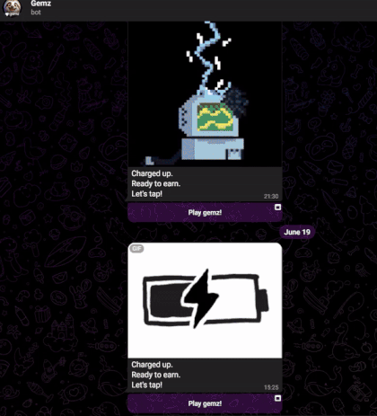

> [!NOTE]
> - Contacts: [Telegram](https://t.me/mudachyo)
> - Channel: [Telegram Channel](https://t.me/shopalenka) 
> - 🇷🇺 README на русском доступен [здесь](README.md)
---
## How to run  
- Install extension in your browser [Violentmonkey](https://chromewebstore.google.com/detail/violentmonkey/jinjaccalgkegednnccohejagnlnfdag?hl=be)
- In order for Gemz to open in a browser, install [this script](https://github.com/mudachyo/Gemz/raw/main/gemz-web.user.js)
- To install **autoclicker** install [this script](https://github.com/mudachyo/Gemz/raw/main/gemz-autoclicker.user.js)
- Open [Bot Gemz](https://web.telegram.org/k/#?tgaddr=tg%3A%2F%2Fresolve%3Fdomain%3Dgemzcoin_boT%26appname%3Dstart_gemz_now%26startapp%3DANzq-UGFW12ahWQ1AxRzw) and run the game
  
- 

---
> [!TIP]
> Other repositories:
> 
> - [Hamster Kombat + Autoclicker](https://github.com/mudachyo/Hamster-Kombat)
> 
> - [TapSwap + Autoclicker](https://github.com/mudachyo/TapSwap)
> 
> - [Blum + Autoclicker](https://github.com/mudachyo/Blum)
>
> - [PixelTap + Autoclicker](https://github.com/mudachyo/PixelTap)
> 
> - [MemeFi + Autoclicker](https://github.com/mudachyo/MemeFi-Coin)
>
> - [Yescoin + Autoclicker](https://github.com/mudachyo/Yescoin)
>
> - [Gemz + Autoclicker](https://github.com/mudachyo/Gemz)
>
> - [Сrossfi + Autoclicker](https://github.com/mudachyo/Crossfi)
>
> - [BUMP](https://github.com/mudachyo/BUMP)
>
> - [W-Coin](https://github.com/mudachyo/W-Coin)
---
> [!IMPORTANT] 
> Donation
> 
> We accept the following cryptocurrencies:
> 
> - **TON**: `UQCGUzPN5GnFqWJiYsFtqqLGO75-cBXlOL8f_qbd7yKY2Tzh`
> 
> - **USDT**(TRC20): `TFr8CiAPqEnSyoXHtVefWumodcXgjoB8rS`
> 
> - **USDT**(TON): `UQCGUzPN5GnFqWJiYsFtqqLGO75-cBXlOL8f_qbd7yKY2Tzh`
> 
> - **NOTCOIN**(TON): `UQCGUzPN5GnFqWJiYsFtqqLGO75-cBXlOL8f_qbd7yKY2Tzh`
> 
> - **BTC**: `1Mba8xKKVLdcFJdV7jD8Ba3fFn7DWbp4bt`
> 
> Donations will be used to maintain the project.